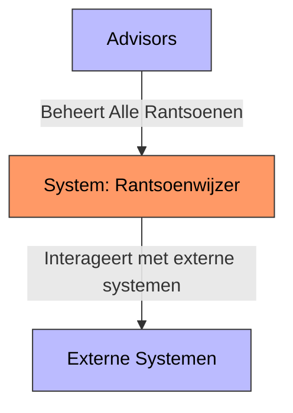
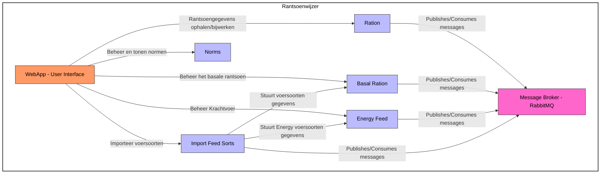
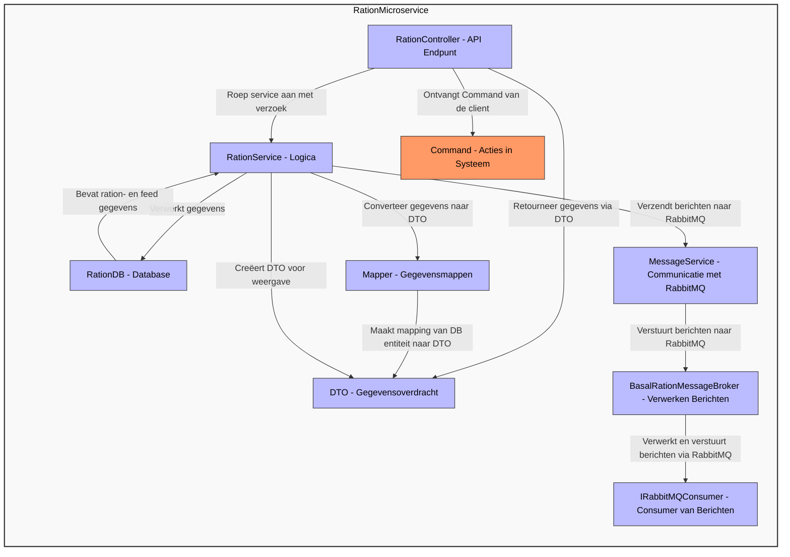
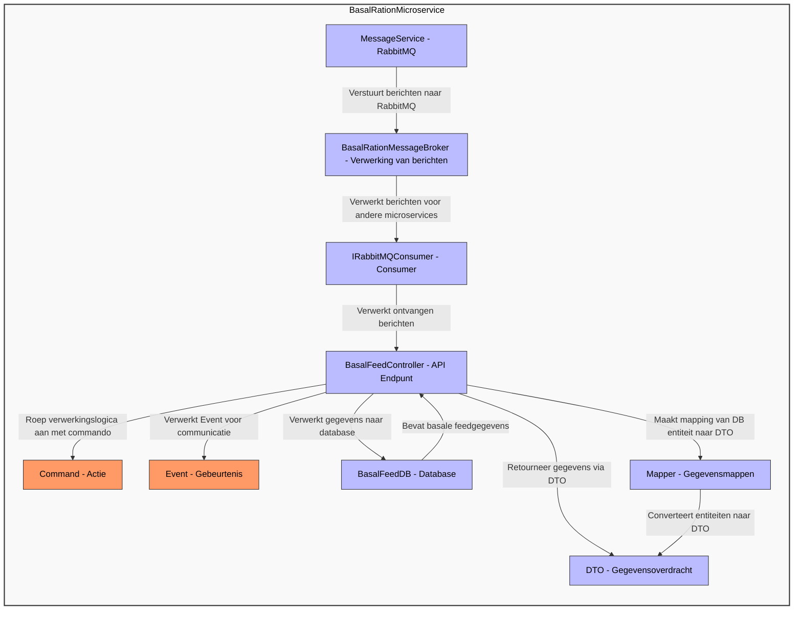
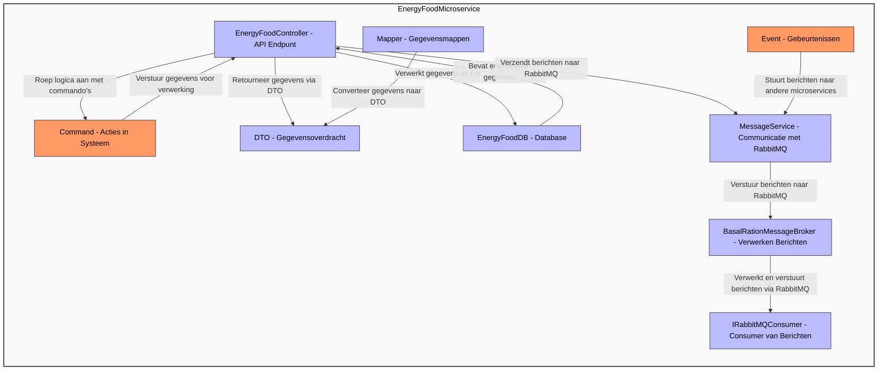
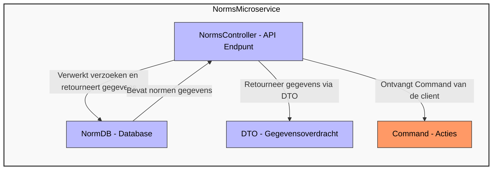

# C4 Model Rantsoenwijzer

## Legenda

| Kleur | Betekenis |
|-------|-----------|
| Wit (#fff)  | Hoofdcomponenten en sub-systemen |
| Lichtblauw (#bbf)  | Algemene componenten |
| Oranje (#f96)  | Gebruikersinterface |

## Context Diagram

**Beschrijving:** Dit diagram toont de hoofdcomponenten van het rantsoenwijzer-systeem en hun interacties. Het advisors beheert alle rantsoenen in het systeem. Daarnaast Het systeem (Rantsoenwijzer) interageert met externe systemen voor aanvullende functionaliteiten.

## Container Diagram

**Beschrijving:** 

Dit containerdiagram biedt een duidelijk overzicht van de verschillende componenten binnen het Rantsoenwijzer-systeem. 

De WebApp fungeert als de centrale gebruikersinterface waarmee eindgebruikers kunnen communiceren. 

Deze applicatie is gekoppeld aan vier specifieke services:
1. **RationAPI**: Beheert rantsoengegevens, zoals het ophalen en bijwerken van informatie over rantsoenen. 
2. **BasalRationAPI**: Regelt het beheer van basale rantsoengegevens, inclusief essentiële informatie over basale voercomponenten.
3. **EnergyFoodAPI**: Verwerkt en beheert gegevens met betrekking tot krachtvoer.
4. **ImportRationAPI**: Stelt gebruikers in staat voersoorten te importeren en integreert deze gegevens in andere services, zoals de BasalRationAPI en EnergyFoodAPI.
5. **NormenAPI**: Regelt het inzicht geven en beheren van de normentabel.

De WebApp communiceert direct met alle services en fungeert als een brug tussen de gebruiker en de backendfunctionaliteiten. Daarnaast stuurt de ImportRationAPI specifieke voersoortengegevens naar zowel de BasalRationAPI en de EnergyFoodAPI.

## Component Diagram

In dit hoofdstuk zal ik het componentdiagram presenteren voor de microservices. Deze diagrammen tonen de belangrijkste onderdelen van de microservices, zoals de **controller**, **service**, **database** en andere componenten zoals **commando's**, **DTO's** en **mappers**. Elk van deze componenten heeft een specifieke rol in de werking van de microservices. Het diagram biedt een visuele representatie van de onderlinge afhankelijkheden en communicatie tussen deze componenten.

### Ration

1. **RationController**
   - **Doel**: Exposeert de API-endpoints zoals GET `{id}`.
   - **Verantwoordelijkheden**:
     - Ontvangt het HTTP-verzoek.
     - Valideert het verzoek (bijv. controleert of de id geldig is).
     - Roept de **RationService** aan om de verwerking uit te voeren.
     - Retourneert een antwoord (bijv. Ok met gegevens of BadRequest bij een fout).

2. **RationService**
   - **Doel**: Bevat de logica voor rationbeheer.
   - **Verantwoordelijkheden**:
     - Verwerkt de commando's zoals `GetFeedTypeOverview` die door de controller worden doorgegeven.
     - Transformeert gegevens naar **DTO's** (bijv. met de methode `CreateFeedTypeOverviewDto`).
     - Haalt gegevens op uit de **RationDB** (via een repository of directe DB-aanroepen).
     - Verantwoordelijk voor de belangrijkste bedrijfslogica die de controller aanroept.
     - Verzendt berichten naar **RabbitMQ** via **MessageService**.

3. **RationDB**
   - **Doel**: Slaat ration- en feedgerelateerde gegevens op in de database.
   - **Verantwoordelijkheden**:
     - Bevat rationgerelateerde gegevens zoals voedertypes, basalen, enz.
     - De **RationService** vraagt de gegevens op uit de database en verwerkt ze.

4. **Commands**
   - **Doel**: Vertegenwoordigen acties of verzoeken in het systeem, gebruikt door de controller om bedrijfslogica te initiëren.
   - **Verantwoordelijkheden**:
     - Draagt de parameters en gegevens die nodig zijn om specifieke acties uit te voeren, zoals het ophalen van een feedtype-overzicht.
     - Deze commando's worden doorgestuurd naar de **RationService** om de benodigde acties uit te voeren.

5. **DTO's (Data Transfer Objects)**
   - **Doel**: Draagt gegevens tussen de service- en controllerlagen.
   - **Verantwoordelijkheden**:
     - Draagt de benodigde gegevens terug van de **RationService** naar de **RationController** in een gestructureerde vorm.
     - Dit maakt het mogelijk om de gegevens tussen lagen te vervoeren zonder de interne structuur van de service bloot te leggen.

6. **Mappers**
   - **Doel**: Transformeert gegevens tussen verschillende formaten (bijv. van database-entiteiten naar DTO's).
   - **Verantwoordelijkheden**:
     - Converteert gegevens van de database (of het domeinmodel) naar **DTO's**.
     - Zorgt ervoor dat de gegevens correct worden opgemaakt en gemapt volgens de behoeften van de service.

7. **MessageService**
   - **Doel**: Verantwoordelijk voor het versturen van berichten naar RabbitMQ.
   - **Verantwoordelijkheden**:
     - Beheert de communicatie met RabbitMQ en verstuurt berichten naar de **BasalRationMessageBroker**.

8. **BasalRationMessageBroker**
   - **Doel**: Verwerkt en verstuurt berichten via RabbitMQ.
   - **Verantwoordelijkheden**:
     - Verwerkt de ontvangen berichten en stuurt ze door naar de **IRabbitMQConsumer** voor verdere verwerking.

9. **IRabbitMQConsumer**
   - **Doel**: Verantwoordelijk voor het consumeren van berichten die via RabbitMQ worden ontvangen.
   - **Verantwoordelijkheden**:
     - Ontvangt en verwerkt de berichten die door de **BasalRationMessageBroker** worden verzonden.

### BasalRation

1. **BasalFeedController**  
   - **Doel**: Exposeert de API-endpoints voor het beheren van basale feedgegevens.
   - **Verantwoordelijkheden**:
     - Ontvangt HTTP-verzoeken van de client.
     - Valideert de aanvragen.
     - Verwerkt de ontvangen commando's en geeft de relevante DTO's terug.
     - Retourneert een response naar de client (bijv. OK, BadRequest).

2. **BasalFeedDB**  
   - **Doel**: Slaat basale feedgerelateerde gegevens op in de database.
   - **Verantwoordelijkheden**:
     - Bevat gegevens over basale voeders, hun eigenschappen en instellingen.
     - Gegevens worden opgevraagd door de controller via de database.

3. **Commands**  
   - **Doel**: Vertegenwoordigen acties of verzoeken in het systeem, gebruikt door de controller om bedrijfslogica te initiëren.
   - **Verantwoordelijkheden**:
     - Draagt de parameters en gegevens die nodig zijn om specifieke acties uit te voeren, zoals het beheren van basale voeders.
     - Worden gebruikt door de **BasalFeedController** om de benodigde logica uit te voeren.

4. **DTO's (Data Transfer Objects)**  
   - **Doel**: Draagt gegevens tussen de controller en de client.
   - **Verantwoordelijkheden**:
     - Draagt de gegevens die door de controller zijn verwerkt naar de client in een gestructureerd formaat.
     - Maakt het mogelijk om gegevens over te dragen tussen lagen zonder de interne structuur van de controller bloot te leggen.

5. **Mappers**  
   - **Doel**: Converteert gegevens van de database of interne representatie naar DTO's.
   - **Verantwoordelijkheden**:
     - Zet database-entiteiten om naar DTO's.
     - Zorgt ervoor dat de gegevens correct worden gemapt naar het vereiste formaat voor de controller en client.

6. **Events**  
   - **Doel**: Gebeurtenissen die aangeven dat er veranderingen zijn in het systeem.
   - **Verantwoordelijkheden**:
     - Stuurt berichten naar andere microservices of systemen om hen te informeren over wijzigingen in de basale ration-feed.
     - Gebruikt om andere delen van de applicatie te informeren over belangrijke veranderingen, zoals updates van feeds.

7. **MessageService en RabbitMQ**  
   - **Doel**: Verwerkt berichten via RabbitMQ voor asynchrone communicatie tussen microservices.
   - **Verantwoordelijkheden**:
     - Verstuurt berichten naar de **BasalRationMessageBroker**.
     - Verwerkt berichten die via RabbitMQ ontvangen worden, en stuurt deze door naar de juiste microservices.

8. **BasalRationMessageBroker**  
   - **Doel**: Gebruikt voor de asynchrone verwerking van berichten via RabbitMQ.
   - **Verantwoordelijkheden**:
     - Ontvangt berichten van de **MessageService**.
     - Verwerkt deze berichten en stuurt ze door naar de juiste microservices via RabbitMQ.

9. **IRabbitMQConsumer**  
   - **Doel**: Interface voor het consumeren van berichten van RabbitMQ.
   - **Verantwoordelijkheden**:
     - Verwerkt berichten die ontvangen worden via RabbitMQ.
     - Stuurt verwerkte berichten door naar andere microservices of systemen.

### EnergyFood

1. **EnergyFoodController**  
   - **Doel**: Exposeert de API-endpoints voor het beheren van energievoer-gerelateerde gegevens.
   - **Verantwoordelijkheden**:
     - Ontvangt HTTP-verzoeken van de client.
     - Valideert de aanvragen.
     - Verwerkt de ontvangen commando's en geeft de relevante DTO's terug.
     - Retourneert een response naar de client (bijv. OK, BadRequest).

2. **EnergyFoodDB**  
   - **Doel**: Slaat energievoergerelateerde gegevens op in de database.
   - **Verantwoordelijkheden**:
     - Bevat gegevens over energievoer, hun eigenschappen en instellingen.
     - Gegevens worden opgevraagd door de controller via de database.

3. **Commands**  
   - **Doel**: Vertegenwoordigen acties of verzoeken in het systeem, gebruikt door de controller om bedrijfslogica te initiëren.
   - **Verantwoordelijkheden**:
     - Draagt de parameters en gegevens die nodig zijn om specifieke acties uit te voeren, zoals het beheren van energievoer.
     - Worden gebruikt door de **EnergyFoodController** om de benodigde logica uit te voeren.

4. **DTO's (Data Transfer Objects)**  
   - **Doel**: Draagt gegevens tussen de controller en de client.
   - **Verantwoordelijkheden**:
     - Draagt de gegevens die door de controller zijn verwerkt naar de client in een gestructureerd formaat.
     - Maakt het mogelijk om gegevens over te dragen tussen lagen zonder de interne structuur van de controller bloot te leggen.

5. **Mappers**  
   - **Doel**: Converteert gegevens van de database of interne representatie naar DTO's.
   - **Verantwoordelijkheden**:
     - Zet database-entiteiten om naar DTO's.
     - Zorgt ervoor dat de gegevens correct worden gemapt naar het vereiste formaat voor de controller en client.

6. **Events**  
   - **Doel**: Gebeurtenissen die aangeven dat er veranderingen zijn in het systeem.
   - **Verantwoordelijkheden**:
     - Stuurt berichten naar andere microservices of systemen om hen te informeren over wijzigingen in energievoer.
     - Gebruikt om andere delen van de applicatie te informeren over belangrijke veranderingen, zoals updates van voeders.

7. **MessageService en RabbitMQ**  
   - **Doel**: Verwerkt berichten via RabbitMQ voor asynchrone communicatie tussen microservices.
   - **Verantwoordelijkheden**:
     - Verstuurt berichten naar de **BasalRationMessageBroker**.
     - Verwerkt berichten die via RabbitMQ ontvangen worden, en stuurt deze door naar de juiste microservices.

8. **BasalRationMessageBroker**  
   - **Doel**: Gebruikt voor de asynchrone verwerking van berichten via RabbitMQ.
   - **Verantwoordelijkheden**:
     - Ontvangt berichten van de **MessageService**.
     - Verwerkt deze berichten en stuurt ze door naar de juiste microservices via RabbitMQ.

9. **IRabbitMQConsumer**  
   - **Doel**: Interface voor het consumeren van berichten van RabbitMQ.
   - **Verantwoordelijkheden**:
     - Verwerkt berichten die ontvangen worden via RabbitMQ.
     - Stuurt verwerkte berichten door naar andere microservices of systemen.

### Norms

1. **NormsController**
   - **Doel**: Exposeert de API-endpoints voor normen.
   - **Verantwoordelijkheden**:
     - Ontvangt het HTTP-verzoek.
     - Valideert het verzoek (bijv. controleert of de norm-id geldig is).
     - Roept de **NormsService** aan om de verwerking uit te voeren.
     - Retourneert een antwoord (bijv. Ok met gegevens of BadRequest bij een fout).

2. **NormDB**
   - **Doel**: Slaat normen gerelateerde gegevens op in de database.
   - **Verantwoordelijkheden**:
     - Bevat normen gerelateerde gegevens.
     - De **NormsService** vraagt de gegevens op uit de database en verwerkt ze.

3. **Commands**
   - **Doel**: Vertegenwoordigen acties of verzoeken in het systeem, gebruikt door de controller om bedrijfslogica te initiëren.
   - **Verantwoordelijkheden**:
     - Draagt de parameters en gegevens die nodig zijn om specifieke acties uit te voeren, zoals het ophalen van normen.
     - Deze commando's worden doorgestuurd naar de **NormsService** om de benodigde acties uit te voeren.

4. **DTO's (Data Transfer Objects)**
   - **Doel**: Draagt gegevens tussen de service- en controllerlagen.
   - **Verantwoordelijkheden**:
     - Draagt de benodigde gegevens terug van de **NormsService** naar de **NormsController** in een gestructureerde vorm.
     - Dit maakt het mogelijk om de gegevens tussen lagen te vervoeren zonder de interne structuur van de service bloot te leggen.

