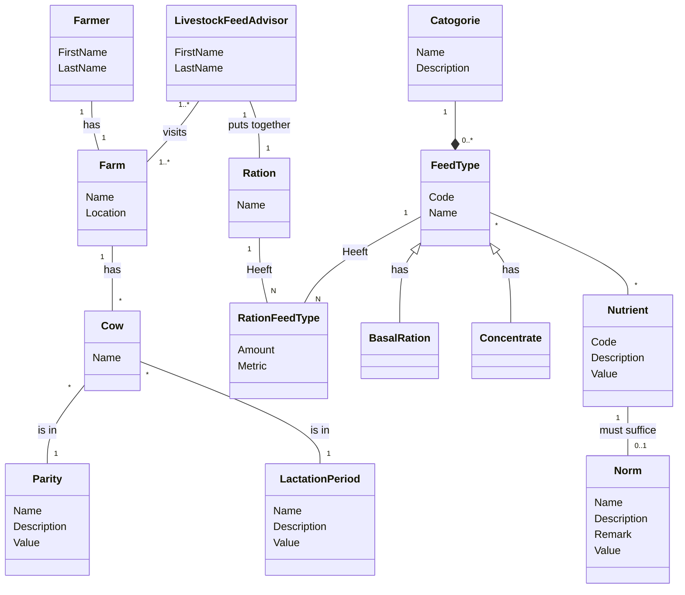

# Rantsoenwijzer

## Domeinmodel

```mermaid
classDiagram
    class BasalRation {
    }
    
    class Concentrate {
    }
    
    class Cow {
        Name
    }
    
    class Nutrient {
        Code
        Description
        Value
    }
    
    class Ration {
        Name
    }
    
    class LivestockFeedAdvisor {
        FirstName
        LastName
    }
    
    class Farmer {
        FirstName
        LastName
    }
    
    class Farm {
        Name
        Location
    }
    
    class Parity {
        Name
        Description
        Value
    }
    
    class LactationPeriod {
        Name
        Description
        Value
    }
    
    class Norm {
        Name
        Description
        Remark
        Value
    }

    class FeedType {
        Code
        Name
    }

    class Catogorie {
        Name
        Description
    }
    
    class RationFeedType {
        Amount
        Metric
    }
    
    Farmer "1"--"1" Farm : has
    Farm "1"--"*" Cow : has
    Cow "*"--"1" Parity : is in
    Cow "*"--"1" LactationPeriod : is in
    LivestockFeedAdvisor "1..*"--"1..*" Farm : visits
    LivestockFeedAdvisor "1"--"1" Ration : puts together
    Ration "1" -- "N" RationFeedType : Heeft
    FeedType "1" -- "N" RationFeedType : Heeft
    FeedType <|-- BasalRation : has
    FeedType <|-- Concentrate : has
    FeedType "*"--"*" Nutrient
    Nutrient "1"--"0..1" Norm : must suffice
    Catogorie "1"--*"0..*" FeedType

```

## Glossary
